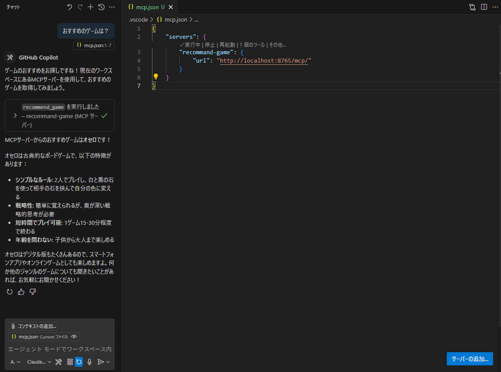

# DockerでStreamable HTTP MCPサーバー構築

## 概要
Docker × Streamable HTTP MCPサーバーでポートを自由に変えることのできるサンプルが見たらないため作成しました。これを利用することで、環境を汚さずにコンテナ管理の上でMCPを利用できます。
分かりやすいようにコードは最小限にしています。
※copilotのchatでのみの検証に注意

## 事前準備
docker、docker-composeを利用できるようにしてください

リポジトリのクローン
```
git clone https://github.com/morikazu1119/sample-mcp-server.
cd sample-mcp-server
```

## コンテナ作成
```
docker compose up --build -d
```

## 利用方法
### Copilot Chat
モードをAgentに変更し、スパナのボタンを押して、その他のツールを追加から、MCPサーバーの追加、HTTP、MCPのURL設定、MCPの名前設定、ワークスペース（どれでも）でMCPを設定が完了。mcp.jsonが以下になるとOK
```
{
    "servers": {
        "sample-server": {
            "url": "http://localhost:8765/mcp/"
        }
    }
}
```

以下のように、おすすめのゲームを聞くとオセロしか答えなくなります。


### Claude
自分がWSLのDockerで構築しており、ややこしいため保留